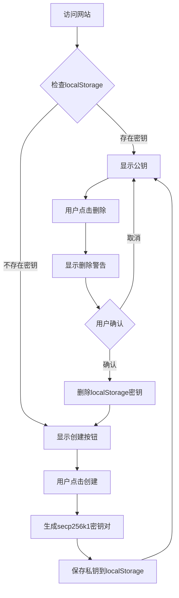

## 1. 产品概述
这是一个交互式Web5教程网站，专注于教育用户了解Web5的核心概念，特别是去中心化身份和加密技术。用户可以通过实际操作学习如何创建和管理数字签名密钥。

目标用户：对Web5和去中心化技术感兴趣的学习者、开发者和区块链技术爱好者。

## 2. 核心功能

### 2.1 用户角色
| 角色 | 注册方式 | 核心权限 |
|------|----------|----------|
| 访客用户 | 无需注册 | 创建/删除签名密钥、查看教程内容 |

### 2.2 功能模块
Web5教程网站包含以下主要页面：
1. **主页**：教程介绍、密钥管理区域、导航菜单
2. **教程页面**：Web5概念讲解、实践步骤指导

### 2.3 页面详情
| 页面名称 | 模块名称 | 功能描述 |
|----------|----------|----------|
| 主页 | 教程介绍区 | 显示Web5教程标题、简介和学习目标 |
| 主页 | 密钥管理区 | 创建secp256k1密钥对、显示公钥、删除密钥功能 |
| 主页 | 状态提示区 | 显示当前密钥状态、操作成功/失败提示 |
| 教程页面 | 概念讲解区 | 介绍Web5、去中心化身份、数字签名等概念 |
| 教程页面 | 实践指导区 | 分步骤指导用户进行密钥操作和相关实践 |

## 3. 核心流程

### 用户操作流程
1. 用户访问网站，系统自动检查localStorage中的签名密钥
2. 如果存在密钥，直接显示对应的公钥信息
3. 如果不存在密钥，显示创建密钥的按钮
4. 用户点击"创建密钥"按钮，系统使用secp256k1算法生成密钥对
5. 私钥以hex字符串形式保存到localStorage，公钥显示在页面上
6. 用户点击"删除密钥"按钮，系统显示高风险警告提示
7. 用户确认后，系统从localStorage中删除私钥并更新界面

## 4. 用户界面设计

### 4.1 设计风格
- **主色调**：深蓝色 (#1a365d) 和青色 (#3182ce)
- **按钮样式**：圆角矩形，3D悬浮效果
- **字体**：Inter 字体族，标题24px，正文16px，小字14px
- **布局风格**：卡片式布局，顶部导航栏，响应式网格
- **图标风格**：使用简洁的线性图标，配合emoji表情符号

### 4.2 页面设计概述
| 页面名称 | 模块名称 | UI元素 |
|----------|----------|--------|
| 主页 | 教程介绍区 | 深蓝色渐变背景，白色文字，居中标题和副标题 |
| 主页 | 密钥管理区 | 白色卡片，包含创建/删除按钮、公钥显示框（等宽字体） |
| 主页 | 状态提示区 | 彩色状态指示器，成功用绿色，警告用橙色，错误用红色 |
| 教程页面 | 概念讲解区 | 左侧图片，右侧文字，交替布局增强可读性 |
| 教程页面 | 实践指导区 | 步骤编号，代码块高亮，操作按钮突出显示 |

### 4.3 响应式设计
- **桌面优先**：默认设计为桌面端，最大宽度1200px
- **移动端适配**：平板端768px，手机端375px断点
- **触摸优化**：按钮最小点击区域44px，支持触摸手势