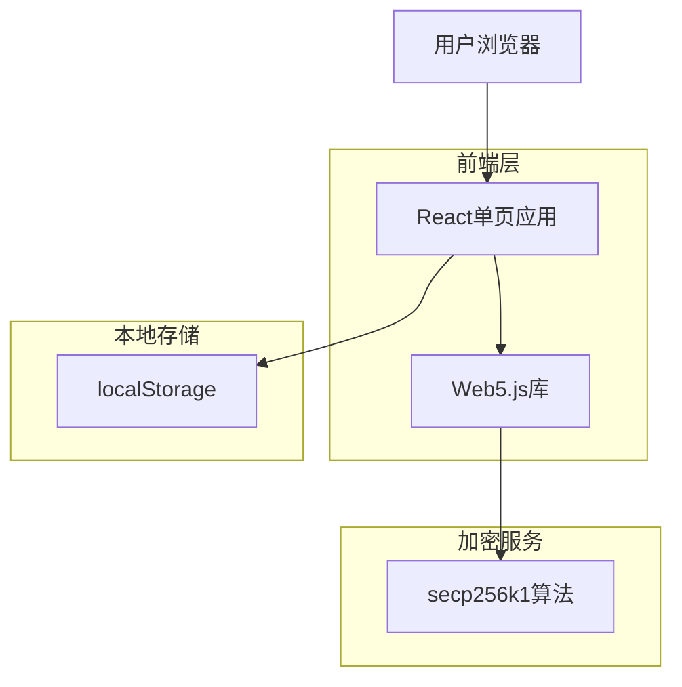

## 1. 架构设计



## 2. 技术描述

* **前端框架**：React\@18 + Vite

* **初始化工具**：vite-init

* **样式方案**：Tailwind CSS\@3

* **加密库**：@web5/crypto 或 noble-secp256k1

* **部署平台**：GitHub Pages

* **后端**：无（纯前端应用）

## 3. 路由定义

| 路由        | 用途                   |
| --------- | -------------------- |
| /         | 主页，显示教程介绍和密钥管理功能     |
| /tutorial | 教程页面，提供Web5概念讲解和实践指导 |

## 4. 核心组件架构

### 4.1 密钥管理组件

```typescript
interface KeyPair {
  publicKey: string;  // Hex格式公钥
  privateKey: string; // Hex格式私钥
}

interface KeyManagerProps {
  onKeyChange: (keyPair: KeyPair | null) => void;
}
```

### 4.2 教程内容组件

```typescript
interface TutorialStep {
  id: number;
  title: string;
  content: string;
  codeExample?: string;
}

interface TutorialSection {
  title: string;
  steps: TutorialStep[];
}
```

## 5. 本地存储设计

### 5.1 数据模型

```typescript
interface LocalStorageData {
  signingKey: {
    privateKey: string;  // secp256k1私钥（Hex格式）
    publicKey: string;   // secp256k1公钥（Hex格式）
    createdAt: string;   // ISO时间戳
  } | null;
}
```

### 5.2 存储键名

* `web5_signing_key`：存储签名密钥对

## 6. 安全考虑

### 6.1 密钥安全

* 私钥仅存储在浏览器localStorage中，不会发送到任何服务器

* 提供明确的删除警告，防止用户意外丢失密钥

* 密钥生成使用浏览器原生加密API

### 6.2 用户提示

* 创建密钥时显示成功提示

* 删除密钥前显示不可恢复的高风险警告

* 页面刷新时自动检测并加载现有密钥

## 7. 部署配置

### 7.1 GitHub Pages配置

```json
{
  "homepage": "https://[username].github.io/[repository-name]",
  "scripts": {
    "predeploy": "npm run build",
    "deploy": "gh-pages -d dist"
  }
}
```

### 7.2 Vite配置

```typescript
export default defineConfig({
  base: '/[repository-name]/',
  build: {
    outDir: 'dist',
    assetsDir: 'assets'
  }
})
```

